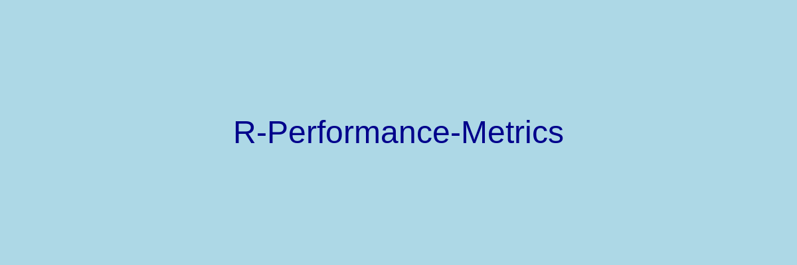
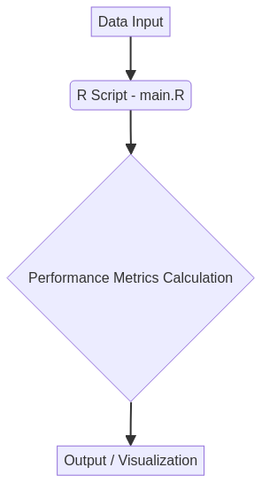

# R-Performance-Metrics



## 📊 Visão Geral do Projeto (Project Overview)

Este repositório apresenta um conjunto de métricas de desempenho para análise de dados em R. O objetivo é fornecer ferramentas robustas para avaliar a performance de modelos e algoritmos, essenciais para cientistas e analistas de dados. O projeto foi desenvolvido por Gabriel Demetrios Lafis.

This repository presents a set of performance metrics for data analysis in R. The goal is to provide robust tools for evaluating the performance of models and algorithms, essential for data scientists and analysts. The project was developed by Gabriel Demetrios Lafis.

## ✨ Funcionalidades (Features)

*   Cálculo de métricas de desempenho comuns em R.
*   Visualização de resultados para facilitar a interpretação.
*   Estrutura modular para fácil extensão e customização.

*   Calculation of common performance metrics in R.
*   Visualization of results for easier interpretation.
*   Modular structure for easy extension and customization.

## 🚀 Começando (Getting Started)

### Pré-requisitos (Prerequisites)

Certifique-se de ter o R instalado em sua máquina. Você pode baixá-lo em [R-Project](https://www.r-project.org/).

Make sure you have R installed on your machine. You can download it from [R-Project](https://www.r-project.org/).

### Instalação (Installation)

1. Clone o repositório:

   ```bash
   git clone https://github.com/galafis/R-Performance-Metrics.git
   cd R-Performance-Metrics
   ```

2. Instale as dependências do R (se houver):

   ```R
   # Exemplo: install.packages("dplyr")
   ```

## 🛠️ Uso (Usage)

Para executar o script principal e calcular as métricas de desempenho:

To run the main script and calculate performance metrics:

```bash
Rscript src/main.R
```

## 🏗️ Arquitetura (Architecture)

O diagrama abaixo ilustra a arquitetura do projeto:

The diagram below illustrates the project's architecture:



## 🤝 Contribuição (Contributing)

Contribuições são bem-vindas! Sinta-se à vontade para abrir issues ou pull requests.

Contributions are welcome! Feel free to open issues or pull requests.

## 📄 Licença (License)

Este projeto está licenciado sob a Licença MIT - veja o arquivo [LICENSE](LICENSE) para detalhes.

This project is licensed under the MIT License - see the [LICENSE](LICENSE) file for details.

## 👤 Autor (Author)

**Gabriel Demetrios Lafis**

*   [GitHub](https://github.com/galafis)
*   [LinkedIn](https://www.linkedin.com/in/gabriel-demetrios-lafis/)

## Badges


